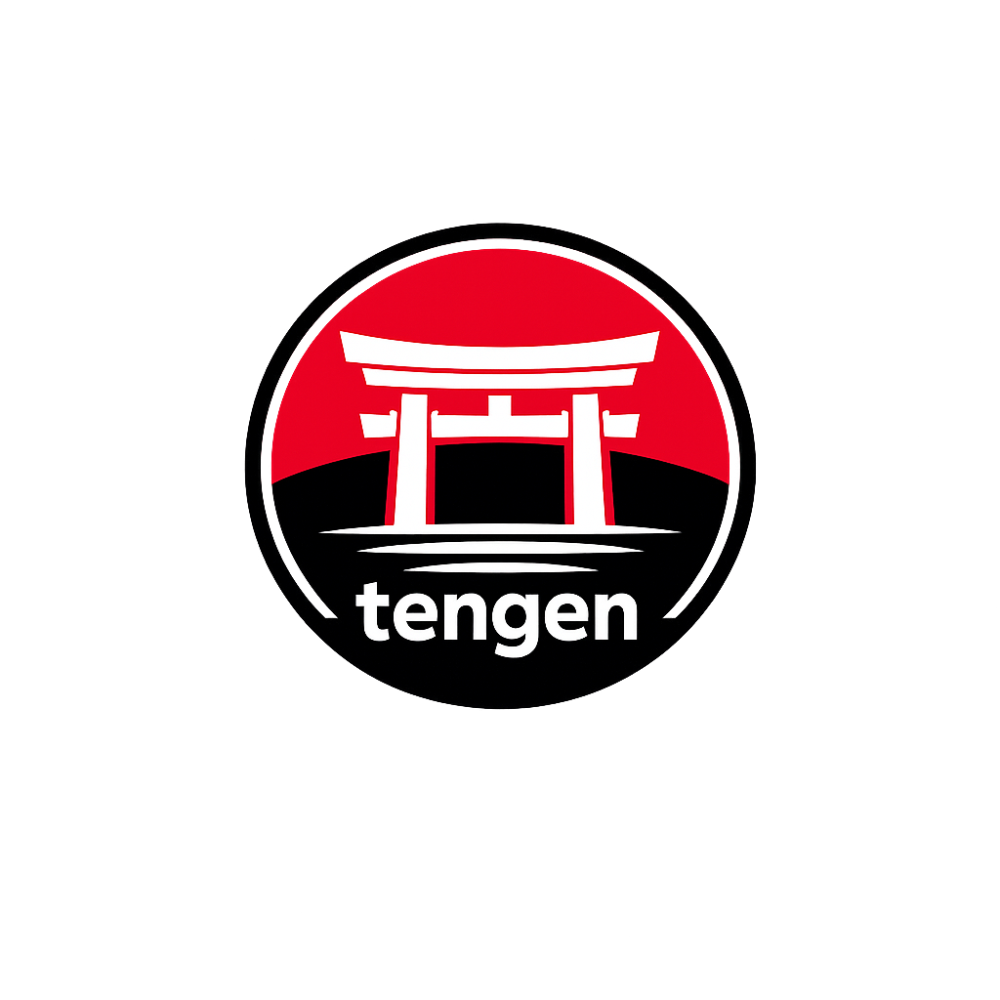
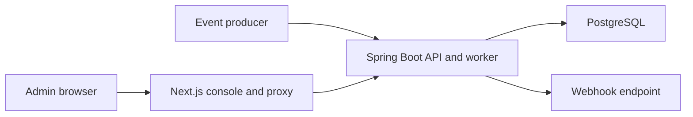

<p align="center">
  
</p>

# Tengen — Complex Event Processing Webapp

Tengen helps teams turn incoming business events into useful actions. You can define rules such as:

- Alert when a payment exceeds a certain amount.
- Detect multiple failed login attempts from the same user.
- Count transactions from a customer within a five-minute window.
- Group activity by user, account, or device.
- Send a webhook when suspicious or important activity is detected.

Tengen receives JSON events, evaluates them against your rules, tracks activity over time, and reports matching events or triggers automated actions. It is designed to help teams build reliable event-driven workflows without writing custom processing logic for every use case.

The project includes a REST API for event ingestion and a web-based administration console for creating rules, testing event behavior, managing API keys, and monitoring webhook deliveries.

## What Tengen Lets You Do

- **Spot important events** using conditions such as payment amount, country, status, or any field in your JSON data.
- **Find patterns over time** with counts, sums, averages, minimums, and maximums over a time window.
- **Track each customer independently** by grouping activity by user, account, device, or another business field.
- **Control notification noise** with cooldowns, rising-edge triggers, and once-per-window delivery.
- **Send webhooks reliably** without making event producers wait for the receiving service.
- **Understand delivery failures** from a searchable history page and safely retry dead-lettered work.
- **Retry event requests safely** without saving, evaluating, or queuing the same logical event twice.

## How It Works

1. An administrator creates and tests a rule in the web console.
2. An application sends a JSON event to Tengen using an API key.
3. Tengen stores the event and evaluates all relevant active rules.
4. Eligible webhook actions are committed to a durable queue, so the event request does not wait for the callback endpoint.
5. A background worker sends each webhook, retries temporary failures, and records the outcome for administrators.

An accepted event response reports which rules matched, which webhook actions were queued, and which actions were suppressed. Queued means the delivery is safely stored; it does not claim that the receiving service has already accepted it.

## Admin Console

| Page | What it is for |
| --- | --- |
| **Rules** | Create, edit, enable, disable, and delete detection rules. |
| **Rule history** | Review immutable revisions, archive rules, and restore an earlier configuration. |
| **Run Test** | Try an event against one or all rules without saving the event or sending webhooks. |
| **API Keys** | Create scoped ingestion keys, view their status, and revoke them. Raw keys are shown only once. |
| **Deliveries** | Filter webhook history, inspect attempts and errors, refresh the list, and retry dead-lettered deliveries. |

Delivery auto-refresh is off by default. It can be enabled when a near-real-time view of active deliveries is useful.

## Quick Start

For local development, you need Docker, Java 21, and Node.js with npm.

Start PostgreSQL and the Spring Boot backend:

```bash
docker compose -f tengen/docker-compose.yml up -d db
cd tengen
WEBHOOK_WORKER_ENABLED=false ./mvnw spring-boot:run
```

Schema changes are managed by Flyway. Before the first start of this version
against an existing database, make a PostgreSQL backup. Flyway baselines the
existing schema at V1 and applies the production-hardening migration; new
databases are built from the same versioned migrations.

```bash
docker exec tengen-db-1 pg_dump -U tengen -d tengen -Fc > tengen-before-migration.dump
```

In another terminal, start the administration console:

```bash
cd frontend
npm ci
npm run dev
```

- Admin console: http://localhost:3000
- Backend API: http://localhost:8080
- Default development login: `admin` / `admin`

> Change `ADMIN_PASSWORD` and `JWT_SECRET` before using Tengen outside local development.

### Important development commands

Run the complete stack from Docker without making outbound webhook requests:

```bash
WEBHOOK_WORKER_ENABLED=false docker compose -f tengen/docker-compose.yml up --build
```

The worker is part of the Spring Boot application. Disabling it keeps webhook
intents in the durable outbox as `PENDING`; it does not disable event ingestion
or rule evaluation. Use `-d` to run in the background:

```bash
WEBHOOK_WORKER_ENABLED=false docker compose -f tengen/docker-compose.yml up --build -d
```

Run the full stack with webhook delivery enabled:

```bash
docker compose -f tengen/docker-compose.yml up --build -d
```

Run the backend and frontend separately while using the Compose PostgreSQL
container:

```bash
docker compose -f tengen/docker-compose.yml up -d db

cd tengen
WEBHOOK_WORKER_ENABLED=false ./mvnw spring-boot:run
```

In another terminal:

```bash
cd frontend
npm ci
npm run dev
```

Run the quality checks without touching the development database. Backend tests
start isolated PostgreSQL Testcontainers automatically:

```bash
cd tengen
./mvnw -q test

cd ../frontend
npm run lint
npm test
npm run build
# Requires a running local stack and a Playwright browser installation.
npm run test:e2e
```

Stop local services without deleting PostgreSQL data:

```bash
docker compose -f tengen/docker-compose.yml down
```

Avoid `down -v` unless you intentionally want to delete the local database
volume.

## Important Changes in This Version

- **Versioned database migrations:** Flyway now owns schema changes and
  Hibernate uses `ddl-auto=validate`. Back up an existing PostgreSQL database
  before the first startup; Tengen will preflight the schema and refuse unsafe
  or unexpected databases.
- **Safer rules:** create, update, restore, and activation requests share one
  validator. Invalid expressions, aggregate settings, trigger combinations,
  and webhook destinations return structured `400` responses. Legacy invalid
  rules are retained for correction but deactivated.
- **Separated admin sessions:** access and refresh JWTs have different types,
  issuers, audiences, and lifetimes. Refresh sessions are hashed, rotated, and
  revoked on replay or logout. The Next.js proxy refreshes an expired access
  cookie automatically.
- **Protected webhooks:** only public HTTPS destinations are accepted. Local,
  private, loopback, link-local, metadata-service, credential-bearing, and
  unsafe redirect destinations are rejected. Deliveries include stable IDs and
  HMAC signatures and remain at-least-once.
- **Ingestion guardrails:** event requests require a valid `X-API-Key`, support
  idempotent retries, enforce body-size and per-key rate limits, and can return
  `413` or `429` when limits are exceeded.
- **Operational visibility:** liveness/readiness endpoints, Prometheus queue
  metrics, bounded retention, delivery leases, retry/dead-letter tracking, and
  structured security logging are included.
- **Quality gates:** backend Testcontainers integration tests, ESLint, Vitest,
  Playwright smoke tests, and CI checks now cover the main admin and delivery
  workflows.

For webhook testing during local development, use a public HTTPS tunnel or keep
the worker disabled. `http://localhost` callback URLs are intentionally rejected.

## Send Your First Event

1. Log in to the admin console and create a rule.
2. Open **API Keys** and create a key. Save the raw `tg_...` value when it is shown.
3. Send an event to the ingestion API:

```bash
curl -X POST http://localhost:8080/api/events \
  -H "Content-Type: application/json" \
  -H "X-API-Key: <your-raw-key>" \
  -H "Idempotency-Key: payment-123" \
  -d '{"type":"payment","source":"billing","data":{"amount":2500,"country":"PH"}}'
```

API keys are hashed at rest and can be restricted by event type and source. An invalid key returns `401 Unauthorized`; a valid key used outside its configured scope returns `403 Forbidden`.

### Safe Request Retries

`Idempotency-Key` is optional but recommended. Create one key for each logical event and reuse it if the request must be retried.

- The same key and equivalent payload replay the original response without processing the event again.
- The same key with a changed payload returns `409 Conflict`.
- Two legitimate events must use different keys, even when their data is identical.

Idempotency keys are scoped to the API key that sent the event.

## Technical Reference

### Rule Behavior

| Concept | Behavior |
| --- | --- |
| **Condition rule** | Matches a single event using its type, source, and an Aviator expression. |
| **Aggregate rule** | Calculates `COUNT`, `SUM`, `AVG`, `MIN`, or `MAX` over an event-time window before comparing it with a threshold. |
| **Grouping** | Maintains independent aggregate and trigger state for values such as `data.userId`. A blank group keeps the rule global. |
| **Cooldown** | Suppresses repeated webhook actions for a configured period without changing whether the rule itself matched. |
| **Every match** | Queues one webhook for every eligible accepted event. |
| **Edge** | Queues a webhook only when a rule changes from non-matching to matching. |
| **Once per window** | Queues at most one webhook for each fixed event-time window and group. |

Aggregate windows exclude the lower time boundary and include the current event. Rule testing includes the candidate event in aggregate calculations but does not persist it, change trigger state, or send a webhook.

### Reliable Webhook Delivery

```text
accepted event
    -> event and webhook intent committed together
    -> PENDING
    -> PROCESSING
       -> DELIVERED
       -> RETRY_SCHEDULED -> PROCESSING
       -> DEAD_LETTER
```

The outbox row stores an immutable snapshot of the destination and payload. Workers claim committed rows using PostgreSQL locking and leases, perform HTTP requests outside database transactions, and recover expired claims after a restart.

Temporary failures such as timeouts, connection errors, `408`, `429`, and `5xx` responses are retried with bounded exponential backoff. Permanent failures and exhausted retries become `DEAD_LETTER` records. Manual retry requeues the same record rather than creating a duplicate delivery.

Successful worker delivery starts or refreshes cooldown state. A failed attempt does not falsely mark the action as delivered.

Webhook delivery is **at least once**. Every attempt for the same outbox row
reuses `X-Tengen-Delivery-Id`, allowing receivers to deduplicate a callback if
the network succeeds but the worker restarts before recording success. Requests
also include `X-Tengen-Timestamp` and `X-Tengen-Signature`; the signature is
`v1=` followed by the hexadecimal HMAC-SHA256 of
`<timestamp>.<raw-json-body>` using `WEBHOOK_SIGNING_SECRET`.

Callbacks must use public HTTPS destinations. Localhost, credentials in URLs,
private/link-local addresses, redirects, and metadata-service destinations are
rejected.

### Technology

| Layer | Technology |
| --- | --- |
| Backend | Spring Boot 4.1, Java 21, Spring Security, Spring Data JPA |
| Rules | Aviator 5.4.3 |
| Frontend | Next.js 15, React 19, MUI 6, TanStack Query, Axios |
| Database | PostgreSQL 17 |
| Authentication | JJWT 0.12.6, httpOnly cookies, and hashed API keys |

### Architecture



- The Next.js application lives in `frontend/` and sends admin requests through [`/api/proxy/[...path]`](frontend/src/app/api/proxy/[...path]/route.ts). The proxy attaches and refreshes JWT credentials server-side.
- The Spring Boot service lives in `tengen/` and owns event processing, rule evaluation, persistence, authentication, and webhook delivery.
- PostgreSQL stores accepted events, rule matches, trigger state, idempotency records, and webhook delivery history.

### API Access

| Endpoint | Access | Purpose |
| --- | --- | --- |
| `POST /api/events` | `X-API-Key` | Accept and evaluate producer events. |
| `/api/auth/login`, `/api/auth/refresh` | Public auth endpoints | Create and refresh an admin session. |
| `/api/rules/**` | Admin session | Manage, test, archive, restore, and inspect rule revisions. |
| `/api/keys/**` | Admin session | Manage ingestion API keys. |
| `/api/webhook-deliveries/**` | Admin session | Search delivery history, inspect details, and retry dead-lettered work. |

Admin access and refresh tokens are stored in httpOnly cookies, so client-side JavaScript does not read them. API keys are stored as hashes and the raw value is available only when a key is created.

## Configuration

The development defaults work with the included Docker Compose database. Expand the tables below when you need to change deployment or worker behavior.

<details>
<summary>Backend environment variables</summary>

| Variable | Default | Purpose |
| --- | --- | --- |
| `SPRING_PROFILES_ACTIVE` | empty | Set to `prod` or `production` to enable production startup checks. |
| `DB_URL` / `DB_USER` / `DB_PASSWORD` | `jdbc:postgresql://localhost:5432/tengen` / `tengen` / `tengen` | PostgreSQL connection. |
| `ADMIN_USER` / `ADMIN_PASSWORD` | `admin` / `admin` | Initial admin credentials. The password is BCrypt-hashed at startup. |
| `JWT_SECRET` | `dev-secret-change-me-please-32-bytes-min` | JWT signing key. Use at least 32 bytes and change it in production. |
| `JWT_ISSUER` / `JWT_AUDIENCE` | `tengen` / `tengen-admin` | Required JWT issuer and audience. |
| `JWT_ACCESS_TTL_MINUTES` / `JWT_REFRESH_TTL_DAYS` | `15` / `7` | Admin access and refresh lifetimes. |
| `CORS_ALLOWED_ORIGINS` | `http://localhost:3000` | Browser origins allowed to access the backend. |
| `WEBHOOK_WORKER_ENABLED` | `true` | Enable automatic webhook delivery. |
| `WEBHOOK_WORKER_POLL_INTERVAL_MS` / `WEBHOOK_WORKER_INITIAL_DELAY_MS` | `1000` / `1000` | Worker polling and startup delays. |
| `WEBHOOK_WORKER_BATCH_SIZE` / `WEBHOOK_WORKER_MAX_ATTEMPTS` | `25` / `8` | Claim batch size and attempts before dead-lettering. |
| `WEBHOOK_WORKER_BASE_DELAY_MS` / `WEBHOOK_WORKER_MAX_DELAY_MS` | `5000` / `900000` | Base and maximum retry backoff. |
| `WEBHOOK_WORKER_LEASE_DURATION_MS` | `300000` | Claim lease used for restart recovery. |
| `WEBHOOK_WORKER_CONNECT_TIMEOUT_MS` / `WEBHOOK_WORKER_READ_TIMEOUT_MS` | `3000` / `5000` | Callback connection and response timeouts. |
| `WEBHOOK_SIGNING_SECRET` | development-only value | HMAC secret used to authenticate webhook deliveries. |
| `INGESTION_MAX_BODY_BYTES` | `1048576` | Maximum event request size, including chunked bodies. |
| `INGESTION_RATE_LIMIT_PER_MINUTE` | `600` | Per-API-key limit for the initial single-instance deployment. |
| `RETENTION_ENABLED` / `RETENTION_DAYS` | `true` / `90` | Terminal operational-data cleanup policy. Rule revisions are never removed. |
| `RETENTION_BATCH_SIZE` / `RETENTION_SCHEDULE` | `1000` / `0 15 3 * * *` | Bounded cleanup batch and UTC cron schedule. |

</details>

<details>
<summary>Frontend environment variable</summary>

| Variable | Default | Purpose |
| --- | --- | --- |
| `BACKEND_API_URL` | `http://localhost:8080` | Server-only backend origin used by the Next.js proxy. Docker Compose supplies `http://app:8080`. |

</details>

Backend defaults are defined in [`application.properties`](tengen/src/main/resources/application.properties).

When the `prod` or `production` profile is active, startup fails if the default
admin password, JWT secret, or webhook signing secret is still configured.
Liveness and readiness are exposed at `/actuator/health/liveness` and
`/actuator/health/readiness`; Prometheus metrics require an authenticated admin
request at `/actuator/prometheus`.

For Docker Compose, put deployment-specific values in an ignored
`tengen/.env` file (or use a secret manager in production):

```dotenv
SPRING_PROFILES_ACTIVE=prod
ADMIN_PASSWORD=replace-with-a-strong-password
JWT_SECRET=replace-with-a-random-secret-at-least-32-characters
WEBHOOK_SIGNING_SECRET=replace-with-another-random-secret-at-least-32-characters
```

Start Compose with that file explicitly:

```bash
docker compose --env-file tengen/.env -f tengen/docker-compose.yml up -d --build
```

## Run the Full Stack with Docker

Build and start PostgreSQL, Spring Boot, and Next.js together:

```bash
docker compose -f tengen/docker-compose.yml up --build -d
```

The services are available on ports `5432`, `8080`, and `3000`, respectively.

To rebuild only the frontend:

```bash
docker compose -f tengen/docker-compose.yml up -d --build frontend
```

## Roadmap

The durable webhook outbox, background delivery worker, automatic retries, dead-letter handling, and delivery-history console are implemented.

See the [CEP roadmap](plans/cep-roadmap-plan.md) for completed work and future capabilities such as sequence and absence patterns, watermarks, broker connectors, and replay or backfill support.

Detailed webhook implementation plans:

- [Durable webhook outbox](plans/durable-webhook-outbox-plan.md)
- [Background delivery worker](plans/webhook-delivery-worker-plan.md)
- [Webhook delivery history](plans/webhook-delivery-history-plan.md)

## License

[MIT](LICENSE) — see the [LICENSE](LICENSE) file for details.

[](https://opensource.org/licenses/MIT)
