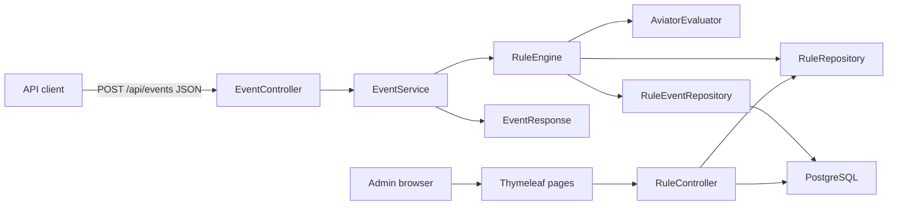
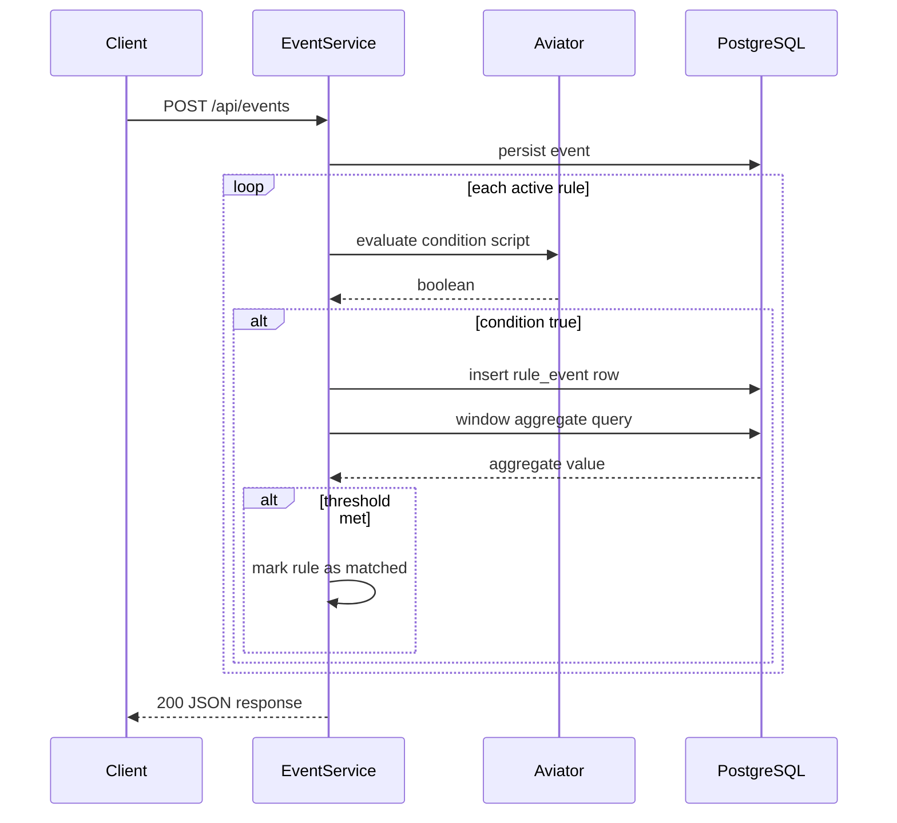
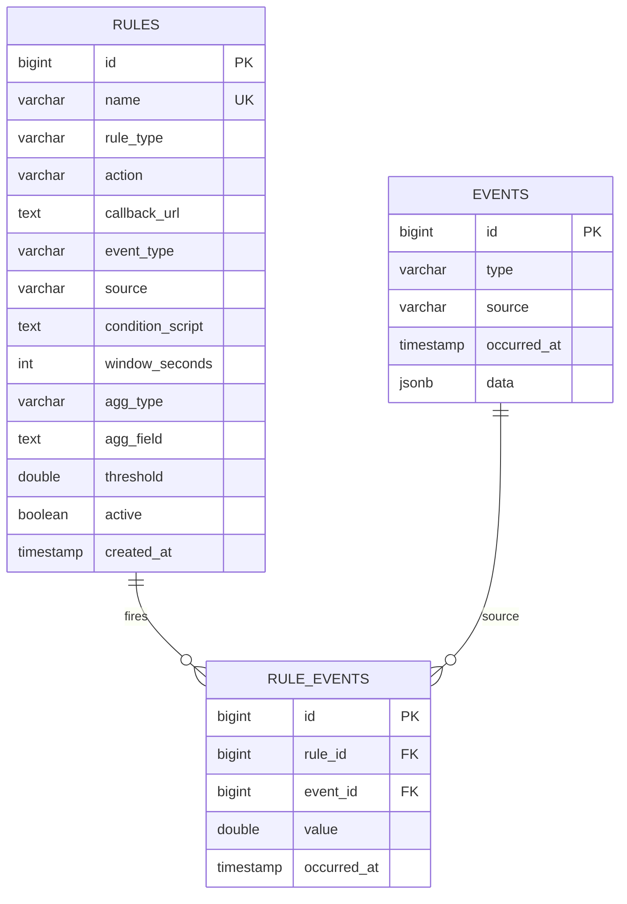

# Event Processor Webapp — Plan

## Status: Implemented and evolved

The Spring Boot event-ingestion and rule-processing baseline is implemented. The original Thymeleaf UI described below was subsequently replaced by the implemented [Next.js and MUI migration](nextjs-mui-migration-plan.md), and synchronous webhook calls were replaced by the durable [outbox](durable-webhook-outbox-plan.md), [background worker](webhook-delivery-worker-plan.md), and [delivery history](webhook-delivery-history-plan.md) slices.

This document retains the original v1 design context; `README.md` and `cep-roadmap-plan.md` describe the current architecture and completed capabilities.

## 1. Overview

A Spring Boot event-processing webapp that:

- Accepts JSON event requests via `POST /api/events`.
- Evaluates each event against admin-defined rules.
- Rules have **one condition** (Aviator script) and **one windowed aggregate** (COUNT / SUM / AVG / MIN / MAX over a time window, e.g. last 5 minutes) that fires when a threshold is met.
- Returns the original event echoed back, plus `status`, `matched`, `rules`, and per-rule aggregate results.
- Provides a Thymeleaf admin UI to create / edit / delete / toggle rules.
- Runs fully via Docker Compose (PostgreSQL + app).

## 2. Tech Stack

| Layer | Technology | Version / Notes |
|---|---|---|
| Language | Java | 21 |
| Framework | Spring Boot | 4.1.0 (already scaffolded) |
| Web (REST + MVC) | spring-boot-starter-webmvc | already scaffolded |
| Persistence | Spring Data JPA + Hibernate | jsonb via `@JdbcTypeCode(SqlTypes.JSON)` |
| Database | PostgreSQL | 17 (Docker image `postgres:17-alpine`) |
| Expression engine | Aviator | `com.googlecode.aviator:aviator` 5.x — verify latest on Maven Central during implementation |
| Templating | Thymeleaf + Thymeleaf extras Spring Security 6 | already scaffolded |
| Security | Spring Security | form login for admin pages; `/api/events` open |
| UI styling | Bootstrap 5 | via WebJar or CDN |
| Build | Maven | already scaffolded |
| Code gen | Lombok | already scaffolded |
| Containerization | Docker Compose | `postgres` + `app` services, multi-stage Dockerfile |

## 3. Architecture



## 4. Event Processing Flow



## 5. Rule Semantics

A rule has a **rule type**, picked from a dropdown when creating it:

- **CONDITION** — fires when the Aviator condition evaluates to true. No window, no aggregate.
- **AGGREGATE** — fires when the Aviator condition is true AND the windowed aggregate over the last `windowSeconds` reaches `threshold`.

A rule also has an **action**, picked from a dropdown when creating it:

- **LOG** (default) — the result is only returned in the API response. No external call.
- **WEBHOOK** — eligible matches are stored in the durable outbox and delivered asynchronously as JSON to the rule's snapshotted `callbackUrl`; trigger mode and cooldown settings control whether a match queues work.

A rule matches an event when:

1. **Pre-filter** — the event's `type` and `source` equal the rule's `eventType` and `source` fields (both form inputs). This scopes the rule without scripting.
2. **Condition** — an Aviator boolean expression evaluated against the event map, e.g. `data.amount >= 1000 && data.country == 'PH'`.
3. **Windowed aggregate (AGGREGATE rules only)** — among events that matched this rule's pre-filter AND condition within the last `windowSeconds`, the aggregate function applied to `aggField` must reach `threshold`, e.g. SUM of `data.amount` over 300s ≥ 4000.

Implementation:

- Every event passing the pre-filter and condition is persisted to `rule_events`, for both rule types (the extracted numeric field value is stored for non-COUNT aggregates; NULL for CONDITION rules).
- The window query is a single SQL aggregate over `rule_events` filtered by `rule_id` and `occurred_at >= now() - window`.
- CONDITION rules match immediately — no `rule_events` lookback required, but rows are still recorded for future upgrades.
- Aviator runs as a thread-safe singleton `AviatorEvaluatorInstance`; the event is passed as a nested `Map` env (`type`, `source`, `timestamp`, `data`).
- Script evaluation errors are logged and treated as non-match — never fail the request.
- WEBHOOK delivery is asynchronous: event ingestion commits the delivery intent without waiting for the callback. The worker records attempts, retries transient failures, and dead-letters exhausted or permanent failures. `callbackUrl` is validated as an HTTP(S) URL when action is WEBHOOK.

## 6. Data Model



- `rules.agg_type` ∈ `COUNT, SUM, AVG, MIN, MAX`; `agg_field` required unless `COUNT`.
- `events.data` stored as jsonb for fidelity; original request echoed back in the response.
- Index on `rule_events(rule_id, occurred_at)` for fast window queries.

## 7. API Contract

### `POST /api/events`

Request:

```json
{
  "type": "transaction",
  "source": "payment-api",
  "timestamp": "2026-07-31T15:30:00Z",
  "data": {
    "customerId": "123",
    "amount": 1500,
    "country": "PH",
    "vip": true
  }
}
```

Response (200, JSON):

```json
{
  "event": { "... original event ..." },
  "status": "accepted",
  "matched": true,
  "rules": ["large-transaction"],
  "aggregates": {
    "large-transaction": {
      "ruleType": "AGGREGATE",
      "function": "SUM",
      "value": 4500.0,
      "threshold": 4000.0,
      "windowSeconds": 300
    }
  }
}
```

- CONDITION rule matches are listed in `rules` only (no `aggregates` entry).
- AGGREGATE rule matches appear in `rules` AND in `aggregates` with the evaluated window value.
- No rule matched → `matched: false`, `rules: []`, `aggregates: {}`, still HTTP 200.
- Missing/invalid payload → 400 with validation error.

### Admin UI (Thymeleaf, form-login protected)

| Route | Purpose |
|---|---|
| `GET /rules` | list rules with active toggle |
| `GET /rules/new` | create form |
| `POST /rules` | save new rule |
| `GET /rules/{id}/edit` | edit form |
| `POST /rules/{id}` | update rule |
| `POST /rules/{id}/delete` | delete rule |
| `POST /rules/{id}/toggle` | activate / deactivate |

Create/edit form fields — each gets its own input:

| Field | Input type |
|---|---|
| Name | text |
| Rule type | dropdown — `CONDITION` (simple match) or `AGGREGATE` (windowed) |
| Action | dropdown — `LOG` (default, return only) or `WEBHOOK` (POST result to a URL) |
| Callback URL | text — shown only when action is WEBHOOK |
| Event type | text (e.g. `transaction`) |
| Source | text (e.g. `payment-api`) |
| Condition (Aviator) | textarea, e.g. `data.amount >= 1000 && data.country == 'PH'` |
| Window (minutes) | number — shown only for AGGREGATE rules |
| Aggregate function | dropdown (COUNT / SUM / AVG / MIN / MAX) — shown only for AGGREGATE rules |
| Aggregate field | text (e.g. `data.amount`) — shown only for AGGREGATE rules |
| Threshold | number (decimal) — shown only for AGGREGATE rules |
| Active | checkbox |

The aggregate and callback fields are conditionally rendered via a small JS toggle driven by the Rule type / Action dropdowns. A "test rule" box lets the admin paste a sample event JSON and see the evaluation result before saving.

## 8. Project Structure (inside `tengen/`)

```
tengen/
├── Dockerfile
├── docker-compose.yml
├── .dockerignore
├── pom.xml
└── src/main/java/com/tengencorp/tengen/
    ├── TengenApplication.java
    ├── config/
    │   ├── AviatorConfig.java          # AviatorEvaluatorInstance bean
    │   └── SecurityConfig.java         # form login, permit /api/events
    ├── event/
    │   ├── api/EventController.java    # POST /api/events
    │   ├── api/EventRequest.java       # validation DTO
    │   ├── api/EventResponse.java
    │   ├── domain/Event.java           # entity
    │   ├── domain/EventRepository.java
    │   └── service/EventService.java   # orchestrates rules
    ├── rule/
    │   ├── domain/Rule.java            # entity
    │   ├── domain/RuleRepository.java
    │   ├── domain/RuleEvent.java       # window row entity
    │   ├── domain/RuleEventRepository.java
    │   ├── domain/AggregateType.java   # enum (COUNT/SUM/AVG/MIN/MAX)
    │   ├── domain/RuleType.java        # enum (CONDITION/AGGREGATE)
    │   ├── domain/RuleAction.java      # enum (LOG/WEBHOOK)
    │   └── service/RuleEngine.java     # condition eval + window query
    │   └── service/WebhookClient.java  # best-effort POST to callbackUrl
    └── web/
        ├── RuleMvcController.java      # admin CRUD + test
        └── templates/ rule-list.html, rule-form.html, rule-test.html
```

`src/main/resources/application.properties`: datasource via env vars (`DB_URL`, `DB_USER`, `DB_PASSWORD`), `spring.jpa.hibernate.ddl-auto=update`.

## 9. Docker Compose

`docker-compose.yml` at `tengen/`:

- `db` service: `postgres:17-alpine`, volume for data, healthcheck (`pg_isready`).
- `app` service: built from multi-stage `Dockerfile` (Maven build stage → `eclipse-temurin:21-jre` runtime), `depends_on: db: condition: service_healthy`, exposes port `8080`, passes DB env vars.

One command: `docker compose up --build` → app at `http://localhost:8080`, admin pages at `http://localhost:8080/rules`.

## 10. Implementation Steps

1. Add Aviator dependency to `pom.xml` (verify latest 5.x version on Maven Central); add Bootstrap WebJar.
2. Configure `application.properties` (env-driven Postgres datasource, ddl-auto, JPA).
3. Create `AviatorConfig` singleton bean and `SecurityConfig` (permit `/api/events`, form login for `/rules`, disable CSRF for the JSON API only).
4. Implement `rule` domain: `Rule`, `RuleEvent`, `RuleRepository`, `RuleEventRepository`, `RuleType`, `AggregateType`, `RuleAction` enums.
5. Implement `RuleEngine`: condition eval, window aggregate query, threshold check; `WebhookClient` for best-effort POST with retries.
6. Implement `event` package: `EventRequest` (validation), `Event` entity (jsonb data), `EventRepository`, `EventService` (persist, run all active rules, dispatch webhooks on match, build response), `EventController`.
7. Implement admin UI: `RuleMvcController` + Thymeleaf templates (list, form with conditional fields, test box) with Bootstrap styling.
8. Write integration tests: rule matching, window aggregation firing, non-match path, webhook dispatch.
9. Create `Dockerfile`, `.dockerignore`, `docker-compose.yml`; verify `docker compose up --build` end-to-end.

## 11. Out of Scope (v1)

- Multi-aggregate / multi-condition rules.
- Async/streaming ingestion (Kafka, etc.).
- Rule versioning and audit history.
- Metrics dashboard.
