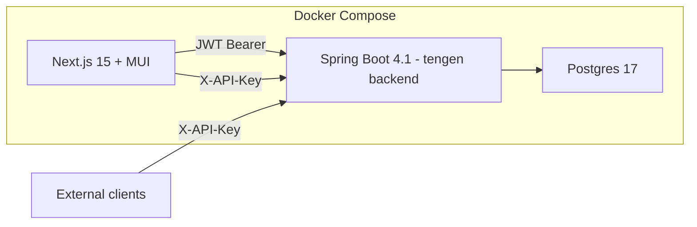

# Plan: Migrate Tengen Admin Frontend from Thymeleaf to Next.js + MUI

## 1. Overview

Replace the Thymeleaf server-rendered admin UI with a **Next.js + MUI (Material UI)** single-page application that talks to a new **REST admin API** on the Spring Boot backend. The backend stays the single source of truth (rules, events, Aviator evaluation); Next.js becomes a pure presentation layer.

Two distinct auth surfaces, designed now to avoid retrofit:

- **Admin UI** (`/api/rules/**`, `/api/auth/**`) — **JWT Bearer** (stateless, SPA-friendly)
- **Event ingestion** (`POST /api/events`) — **API keys** (`X-API-Key` header), foundational `api_keys` table + filter built during this migration

## 2. Target Architecture



- Backend exposes only REST JSON — Thymeleaf controllers/templates are removed
- Next.js runs as a separate container (own port) and in dev on localhost:3000
- CORS: backend allows the Next.js origin (localhost:3000 dev / container network prod)
- Dev loop: local `./mvnw spring-boot:run` + `npm run dev` — no Docker rebuild per change

## 3. Backend Work (Spring Boot)

### 3.1 REST Admin API — `RuleAdminController`

New `@RestController` at `/api/rules` replacing [`RuleMvcController`](tengen/src/main/java/com/tengencorp/tengen/web/RuleMvcController.java:29). All responses JSON.

| Method | Path | Purpose |
|---|---|---|
| GET | `/api/rules` | List all rules |
| GET | `/api/rules/{id}` | Get one rule |
| POST | `/api/rules` | Create rule |
| PUT | `/api/rules/{id}` | Update rule |
| DELETE | `/api/rules/{id}` | Delete rule |
| PATCH | `/api/rules/{id}/toggle` | Flip active flag |
| POST | `/api/rules/test` | Run test (mode single/all) |

Request/response DTOs:

- `RuleRequest` — mirrors current [`RuleForm`](tengen/src/main/java/com/tengencorp/tengen/web/RuleForm.java:21) fields, but `windowSeconds` directly (no minutes conversion) + bean validation
- `RuleResponse` — `Rule` entity serialized (id, name, ruleType, action, callbackUrl, eventType, source, conditionScript, windowSeconds, aggType, aggField, threshold, active, createdAt, updatedAt)
- `RuleTestRequest` — `{ mode: "single"|"all", ruleId?: number, eventJson: string }`
- `RuleTestResponse` — single mode: `{ rule, matched, conditionMatched, aggregateValue, event }`; all mode: `{ results: RuleResult[], anyMatched, event }` reusing the existing [`RuleResult`](tengen/src/main/java/com/tengencorp/tengen/web/RuleMvcController.java:218) shape
- `ErrorResponse` — `{ timestamp, status, error, message, path }`

Reuse [`RuleEngine.test()`](tengen/src/main/java/com/tengencorp/tengen/rule/service/RuleEngine.java:58) and `parseEvent` logic (move to a shared `EventJsonParser` or into the controller).

### 3.2 JWT Auth for Admin

Add dependencies: `jjwt-api`, `jjwt-impl`, `jjwt-jackson` (0.12.x).

| Component | Responsibility |
|---|---|
| `JwtService` | Issue access token (15 min) + refresh token (7 days); HMAC secret from `JWT_SECRET` env |
| `JwtAuthFilter` (`OncePerRequestFilter`) | Parse `Authorization: Bearer`, validate signature/expiry, set `SecurityContext` |
| `AuthController` | `POST /api/auth/login` (admin/admin) → `{ accessToken, refreshToken }`; `POST /api/auth/refresh` |
| `AdminUser` | Move in-memory admin user to env-driven credentials (`ADMIN_USER`/`ADMIN_PASSWORD`, BCrypt) |

Update [`SecurityConfig`](tengen/src/main/java/com/tengencorp/tengen/config/SecurityConfig.java:19):

- `permitAll`: `/api/auth/login`, `/api/auth/refresh`
- `authenticated`: `/api/rules/**`
- **API key path**: `/api/events` → `ApiKeyAuthFilter` (below)
- Keep `/api/**` CSRF-disabled; drop formLogin/Thymeleaf-only matchers (`/rules`, `/webjars/**`)

### 3.3 API Keys for Event Ingestion (foundation)

New package `com.tengencorp.tengen.apikey`:

| Component | Responsibility |
|---|---|
| `ApiKey` entity | `id`, `name`, `keyHash` (SHA-256 hex), `prefix` (e.g. `tg_abc123` shown once), `allowedEventTypes` (jsonb list, nullable = all), `allowedSources` (jsonb list, nullable = all), `active`, `expiresAt`, `createdAt` |
| `ApiKeyRepository` | Lookup by `keyHash` |
| `ApiKeyService` | `generate()` returns raw key once + stores hash; `isValid(rawKey, event)` checks active/expiry/scope |
| `ApiKeyAuthFilter` | Reads `X-API-Key`, validates, populates `SecurityContext` with `ApiKeyPrincipal` |
| `ApiKeyAdminController` | `GET/POST /api/keys`, `POST /api/keys/{id}/revoke` — admin-protected (JWT) |
| `ApiKeyRequest`/`ApiKeyResponse` | DTOs; response includes raw key **only on creation** |

`EventController` / `EventService` gain a `principal` param so `/api/events` can record which key ingested the event (column `api_key_id` on `events`).

### 3.4 CORS

`WebMvcConfigurer` bean: allow origin `http://localhost:3000` (dev) and internal container hostname (prod), methods GET/POST/PUT/PATCH/DELETE/OPTIONS, headers `Authorization`, `Content-Type`, `X-API-Key`.

### 3.5 Cleanup

- Delete `templates/`, `RuleMvcController`, `RuleForm`, `HomeController`, `thymeleaf-extras-springsecurity6` dep, Bootstrap WebJar
- Keep `POST /api/events` contract identical for existing clients (besides new optional auth)

## 4. Frontend Work (Next.js + MUI)

New `frontend/` directory at workspace root (sibling of `tengen/`).

### 4.1 Scaffold

- `create-next-app@latest frontend` — TypeScript, App Router, no Tailwind (MUI instead)
- Dependencies: `@mui/material`, `@mui/icons-material`, `@emotion/react`, `@emotion/styled`, `@tanstack/react-query` (server state), `axios`
- Theme: MUI `createTheme` — primary dark, consistent with current dark navbar branding

### 4.2 Structure

```
frontend/src/
├── app/
│   ├── layout.tsx            # ThemeProvider, CssBaseline, AppBar (Tengen brand + nav)
│   ├── login/page.tsx        # MUI TextField + Button login form
│   ├── rules/page.tsx        # DataGrid list (name/type/action/active), toggle/delete/edit
│   ├── rules/new/page.tsx    # RuleForm (create)
│   ├── rules/[id]/edit/page.tsx # RuleForm (edit)
│   └── rules/test/page.tsx   # mode toggle (single/all), rule dropdown, JSON editor, results
├── components/
│   ├── RuleForm.tsx          # field groups: basics, aggregate section, condition textarea
│   ├── TestResultsPanel.tsx  # single verdict + all-rules table
│   └── StatusBadge.tsx
├── lib/
│   ├── api.ts                # axios instance: baseURL http://localhost:8080, interceptors (attach JWT, refresh on 401)
│   ├── auth.ts               # login/refresh/logout, token cookie (httpOnly via Next.js route handlers)
│   └── types.ts              # Rule, RuleResult, TestResult, ApiKey DTOs
└── middleware.ts             # route guard: redirect to /login if no session
```

### 4.3 Auth flow

- `POST /api/auth/login` from `/login` page → tokens returned → stored in httpOnly cookie via a Next.js route handler (`/api/auth/session`) so the browser never sees the JWT
- `lib/api.ts` axios interceptor attaches `Authorization` from the server-side cookie (route handlers / server components) — keeps tokens out of client JS

### 4.4 Page mapping (Thymeleaf → Next.js)

| Current Thymeleaf | Next.js page |
|---|---|
| [`rule-list.html`](tengen/src/main/resources/templates/rule-list.html) | `/rules` — MUI DataGrid + toolbar (Run Test, New Rule) |
| [`rule-form.html`](tengen/src/main/resources/templates/rule-form.html) | `/rules/new`, `/rules/[id]/edit` — MUI form with conditional aggregate fields |
| [`rule-test.html`](tengen/src/main/resources/templates/rule-test.html) | `/rules/test` — RadioGroup mode, Select rule, TextField JSON, results panel |
| [`fragments/nav.html`](tengen/src/main/resources/templates/fragments/nav.html) | AppBar in `layout.tsx` (Tengen brand, Rules/Run Test/API Keys nav, logout) |

### 4.5 Docker for frontend

- `frontend/Dockerfile` — multi-stage: `npm ci` → `npm run build` → `next start` (port 3000)
- Extend `docker-compose.yml`: `frontend` service with `NEXT_PUBLIC_API_URL=http://backend:8080`, depends on `app`
- Backend CORS allows the frontend origin in the compose network

## 5. Dev Workflow (no Docker rebuild per change)

```bash
# Terminal 1 — backend (devtools auto-restart)
docker compose up -d db
cd tengen && ./mvnw spring-boot:run

# Terminal 2 — frontend (hot reload)
cd frontend && npm run dev
```

Backend on `:8080` (API base for axios), frontend on `:3000`. Full `docker compose up --build -d` only for production-shape verification.

## 6. Implementation Steps
> Status: all 12 steps implemented and verified (`./mvnw compile`, `npm run build`, `docker compose up --build -d` smoke-tested).

1. **Backend: REST admin API** — `RuleAdminController` + DTOs (`RuleRequest`/`RuleResponse`/`RuleTestRequest`/`RuleTestResponse`), reuse `RuleEngine.test()`, bean validation, 404 handling, `@RestControllerAdvice` error contract
2. **Backend: JWT auth** — deps, `JwtService`, `JwtAuthFilter`, `AuthController`, env-driven admin credentials, rewire `SecurityConfig` (drop form login, protect `/api/rules/**`)
3. **Backend: API keys** — `ApiKey` entity + repository + service (hashed, scoped), `ApiKeyAuthFilter` on `/api/events`, `ApiKeyAdminController` (JWT-protected), event `api_key_id` column
4. **Backend: CORS** — `WebMvcConfigurer` bean for Next.js origins
5. **Backend: cleanup** — delete Thymeleaf templates, `RuleMvcController`, `RuleForm`, `HomeController`, `thymeleaf-extras-springsecurity6`, Bootstrap WebJar; verify all builds `-DskipTests`
6. **Frontend: scaffold** — `create-next-app`, MUI deps, theme, AppBar layout, axios client, types
7. **Frontend: auth** — login page, session route handler (httpOnly cookie), middleware route guard, interceptor refresh
8. **Frontend: rules pages** — list (DataGrid, toggle/delete/edit), create, edit (conditional aggregate fields)
9. **Frontend: test page** — mode toggle, rule select, JSON editor, single + all-results panels
10. **Frontend: API keys page** — list keys, create (show raw once), revoke
11. **Docker** — frontend Dockerfile + compose service, CORS/origin wiring, end-to-end `docker compose up --build -d` verification
12. **Docs** — update `README`/plan with run instructions, env vars (`JWT_SECRET`, `ADMIN_USER`, `ADMIN_PASSWORD`, `NEXT_PUBLIC_API_URL`)

## 7. Out of Scope (v2)

- API key rate limiting / quotas
- RBAC roles beyond admin (e.g., read-only viewer)
- Multi-tenancy
- Event history/audit UI in Next.js
